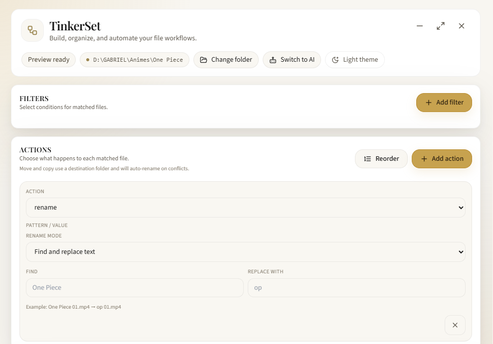
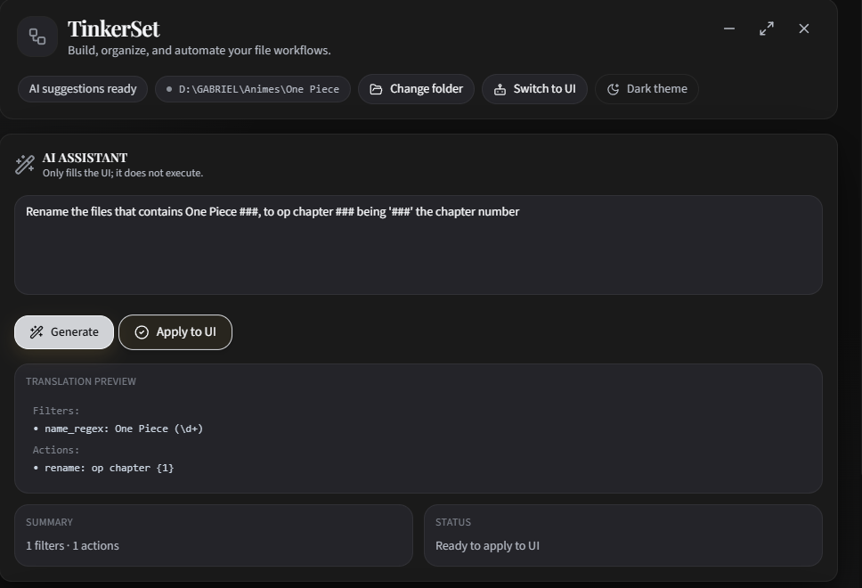
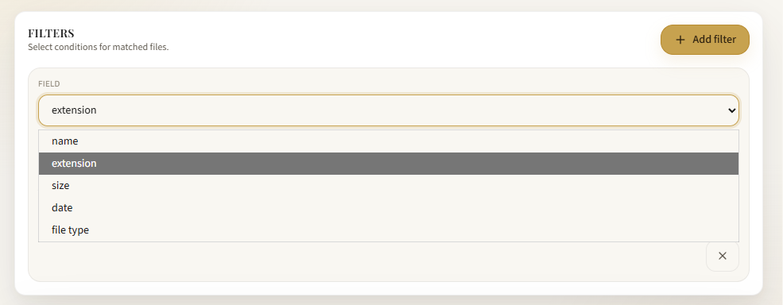
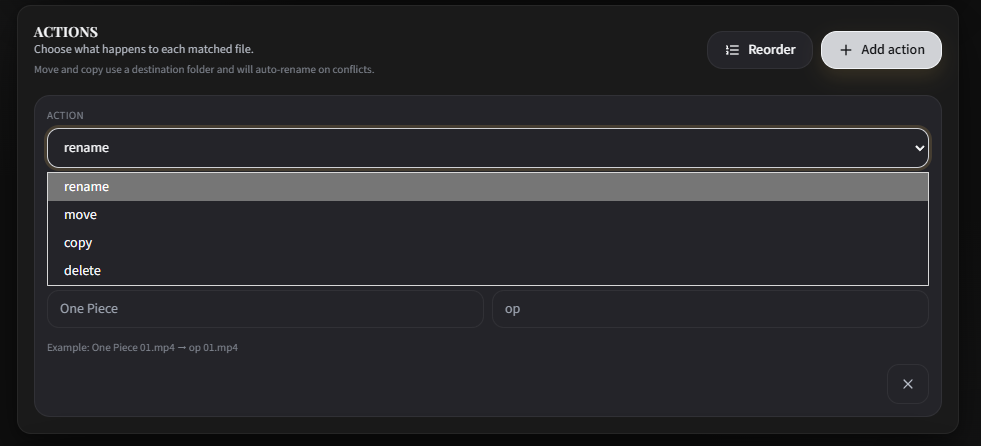
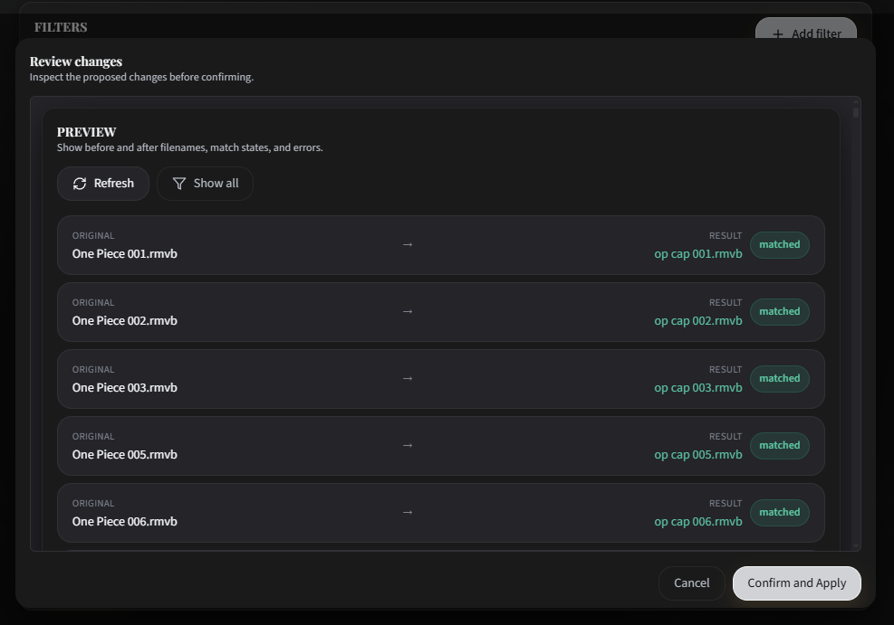

# AI File Manager

AI File Manager is a desktop application built with **Tauri**, **React**, and **FastAPI** for organizing files in a local folder. It is designed to help users define file rules visually or through natural language, preview the results before applying them, and then execute the selected changes safely.



> Internal project name: **TinkerSet**.

## What the app does

The app focuses on two main workflows:

### 1. Visual file organization
You can manually build a file workflow by choosing:

- a target folder
- one or more filters to select files
- one or more actions to apply to the selected items

The application then generates a **preview** of the results before any change is made.

### 2. AI-assisted workflow generation
You can also describe what you want in plain language and let the AI assistant generate a suggested workflow. The AI output can then be reviewed and adjusted in the visual editor before execution.



## Main functionalities

### Folder-based processing
- Select a local folder as the target workspace
- Scan the folder contents from the desktop app
- Work on files and, when needed, folders too

### Filters
The app can filter items using rules such as:
- file extension
- file name exact match
- name contains text
- name regex patterns
- file size greater than / less than a threshold
- modification date before / after a date
- file type: files, folders, or both



### Actions
The app can apply these actions to matched items:
- rename using a template
- rename by replacing text
- sequential numbering with optional padding
- move items to another folder
- copy items to another folder
- delete items



### Safe preview workflow
- Preview mode shows what would happen before anything is changed
- Execution mode only runs after review and confirmation
- If the app is in AI mode, it does not execute changes directly



### Desktop and backend architecture
- The **Tauri + React** frontend provides the desktop UI
- The **FastAPI** backend processes jobs, previews actions, and executes file operations
- The app can run locally during development and communicate with the backend through `http://127.0.0.1:8000`

## How the app works

1. You select a target folder.
2. You define filters to decide which files should be affected.
3. You define actions to transform or move the matched items.
4. The app generates a preview of the result.
5. You review the changes.
6. If everything looks correct, you confirm execution.

In AI mode, the process is similar, but the workflow is generated from a prompt instead of being built manually.

## Installation for project contributors

### Prerequisites

Install the following tools before working on the project:

- **Node.js** and **npm**
- **Python 3.9+**
- **Rust** toolchain for Tauri builds
- **MSYS2 / mingw64** on Windows
- **PowerShell 5.1+** on Windows

On Windows, make sure this directory is available in `PATH` when building Tauri:

- `C:\msys64\mingw64\bin`

### 1. Clone the repository

```bash
git clone <repository-url>
cd ai-file-manager
```

### 2. Install frontend dependencies

From the project root:

```bash
cd frontend
npm install
```

### 3. Install backend dependencies

The backend uses FastAPI and several Python packages. Install the needed dependencies with:

```bash
python -m pip install -r requirements.txt
```

If you prefer, you can install them inside a virtual environment.

The reusable Python utilities now live under scripts/ and the standalone checks live under tests/.

### 4. Configure environment variables

Create a `.env` file in the project root if you want to customize the AI provider or model settings.

Example variables used by the backend:

```env
AFM_LLM_PROVIDER=groq
AFM_GROQ_BASE_URL=https://api.groq.com/openai/v1
AFM_GROQ_MODEL=llama-3.3-70b-versatile
```

### 5. Run the app in development

From the project root:

```bash
npm run tauri:dev
```

This starts the Tauri desktop app with the frontend and backend connected for local development.

## Useful project scripts

From the project root:

- `npm run frontend:dev` — run the frontend in Vite dev mode
- `npm run frontend:build` — build the frontend
- `npm run backend:dev` — run the FastAPI backend
- `npm run tauri:dev` — run the desktop app in development
- `npm run tauri:build` — build the release version

You can also run the Python maintenance helpers directly from scripts/, for example:

- `python scripts/convert_icon.py`
- `python scripts/update_prompt.py`
- `python tests/test_ui.py`

## Notes

- The app is designed for local file management on the user's machine.
- Preview before execution is the recommended workflow for safety.
- AI suggestions are only a starting point and should be reviewed before applying them.
